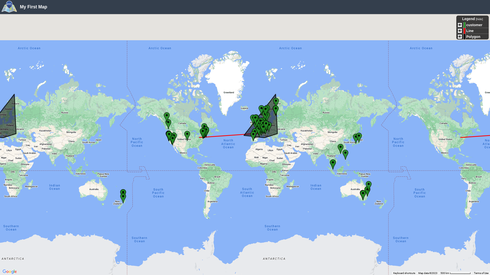

# Mint-Classic-Data-analysis
## Data Analytics Project of coursera

Live Report [](https://docs.google.com/document/d/1j8eecRUBcN4NMuiBIorK1sW9E-IlQy77GxDl8cTzdT0/edit?usp=sharing)


# Abbreviations and custom metrics


<table>
  <tr>
   <td><strong>metrics</strong>
   </td>
   <td><strong>Full form</strong>
   </td>
   <td><strong>Formula</strong>
   </td>
   <td><strong>Increased indicates</strong>
   </td>
   <td><strong>Decreased indicates</strong>
   </td>
  </tr>
  <tr>
   <td>QP
   </td>
   <td>Profit per Quantity
   </td>
   <td>Profit/Sells
   </td>
   <td>Profitable product
   </td>
   <td>Less Profitable Product
   </td>
  </tr>
  <tr>
   <td>SO
   </td>
   <td>Orders Per Stock
   </td>
   <td>Orders/stock
   </td>
   <td>Low stock compared to demand
   </td>
   <td>High stock compared to Demand
   </td>
  </tr>
</table>


# 


# Recommendation

**Can we afford to close one warehouse?**


* **_General summary_**

Yes , you can , i have done exploratory data analysis on given dataset and here are my main finding:


1. We are heavily overstocked [](https://docs.google.com/document/d/1j8eecRUBcN4NMuiBIorK1sW9E-IlQy77GxDl8cTzdT0/edit#heading=h.c02562tyi8e)

2. We have 1 non moving asset ( Toyota supra , 7.6k units , 0 sold )
3. We also have lot of slow moving assets 

   Click [](https://docs.google.com/document/d/1j8eecRUBcN4NMuiBIorK1sW9E-IlQy77GxDl8cTzdT0/edit#heading=h.e6osm1sl7bn7)


**Which warehouse to close?**

Based on my analysis we can close “a” and “d” warehouse. Given that B and C has most storage closing them would be harmful in heavy demand. Also dataset has no information regarding warehouse location other than their name east , west, noth , south. I tried to locate warehouse based on customer orders and delivery time but given that dataset does not contain information regarding mode of transportation, i was not able to locate them. So here is few information regarding warehouses which will help you in making decision.





* Warehouse Near France & Germany should not be close, if warehouse is in USA east then it is best location given that we can delivery product fast to high demand country
* Warehouse near Ocean ( which i suspect is d) can be closed if other warehouse is also located near Ocean, due to inventory of D is filled with planes , ships & trains 
* Delivery time to Japan will always be 4-7 days so trying to reduce that amount is unnecessary as it will impact other parts of bussiness

Here is list of ProductLine of each warehouse


<table>
  <tr>
   <td><strong>Warehouse</strong>
   </td>
   <td><strong>ProductLine</strong>
   </td>
   <td><strong>Count</strong>
   </td>
  </tr>
  <tr>
   <td rowspan="2" ><strong>a</strong>
   </td>
   <td><strong>motorcycles</strong>
   </td>
   <td><strong>13</strong>
   </td>
  </tr>
  <tr>
   <td><strong>Planes</strong>
   </td>
   <td><strong>12</strong>
   </td>
  </tr>
  <tr>
   <td><strong>b</strong>
   </td>
   <td><strong>Classic Cars</strong>
   </td>
   <td><strong>38</strong>
   </td>
  </tr>
  <tr>
   <td><strong>c</strong>
   </td>
   <td><strong>Vintage Cars</strong>
   </td>
   <td><strong>24</strong>
   </td>
  </tr>
  <tr>
   <td rowspan="3" ><strong>d</strong>
   </td>
   <td><strong>Trucks and buses</strong>
   </td>
   <td><strong>11</strong>
   </td>
  </tr>
  <tr>
   <td><strong>Ships</strong>
   </td>
   <td><strong>9</strong>
   </td>
  </tr>
  <tr>
   <td><strong>Trains</strong>
   </td>
   <td><strong>3</strong>
   </td>
  </tr>
</table>


```SQL
USE mnt2;
SELECT  p.productLine, COUNT(p.productCode) AS counts
FROM products AS p 
WHERE p.warehouseCode = "d"
GROUP BY p.productLine
```


**Products in Each Warehouse:** sheet [](https://docs.google.com/spreadsheets/d/11syGk5Adqoefm12b1G9derCVJiY6Xw9vwPaLrroHQ4w/edit#gid=1204989991)

**How to close warehouse?**

I have adjusted Products in Stock , increased understocked products and decreased overstocked products setting SO near 0.8 for understock and 0.4 for overstock products. Here are steps [](https://docs.google.com/document/d/1j8eecRUBcN4NMuiBIorK1sW9E-IlQy77GxDl8cTzdT0/edit#heading=h.frvr1fy9omtx)
